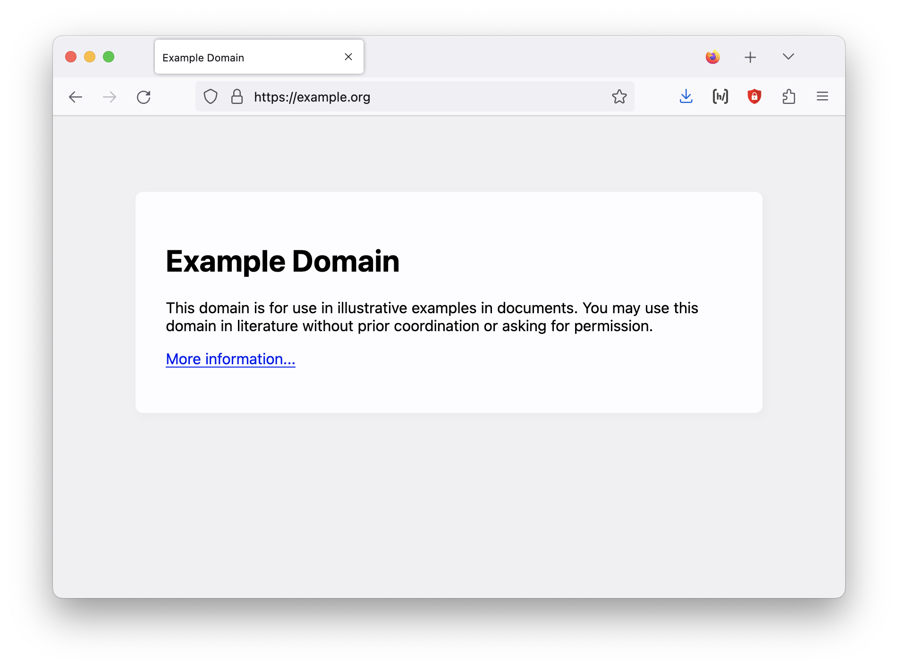

:::{.header-left-right }
## Outline

```{=html}
<table>
<tr>
  <td>Designing</td>
  <td><td>
</tr>
<tr>
  <td>Building</span></td>
  <td><td>
</tr>
<tr>
  <td>Asynchronous</td>
  <td><td>
</tr>
<tr>
  <td>Remote</td>
  <td><td>
</tr>
<tr>
  <td>Fieldwork tool</span></td>
  <td><td>
</tr>
<tr>
  <td>Web Platform</td>
  <td><td>
</tr>
</table>
```

:::

:::{.header-left-right }
## Before the web: FTP (File Transfer Protocol)


:::{.terminal}
```shell
220 Welcome to FTP Server
User (ftp.server.com:(none)): pat
331 Password required for pat
Password: ********
230 User pat logged in
Remote system type is UNIX.
Using binary mode to transfer files.
ftp> ls
200 PORT command successful
150 Opening ASCII mode data connection for file list
drwxr-xr-x   2 pat     ftpusers      4096 Jan 1 12:00 documents/
drwxr-xr-x   2 pat     ftpusers      4096 Jan 1 12:00 images/
-rw-r--r--   1 pat     ftpusers      1.2K Jan 1 12:00 story.txt
226 Transfer complete
ftp> get story.txt
200 PORT command successful
150 Opening BINARY mode data connection for story.txt (4096 bytes)
226 Transfer complete
ftp> quit
221 Goodbye
```
:::


<article class=conversation>
<p class="speech-bubble-right server" data-type="🌐server" data-type="🌐server">
Greetings from your friendly local <code>FTP</code> Server. What’s your name?
</p>
<p class="speech-bubble-left user" data-type="👨user">
Pat
</p>
<p class="speech-bubble-right server" data-type="🌐server">
Password please?
</p>
<p class="speech-bubble-left user" data-type="👨user">
•••••••••
</p>
<p class="speech-bubble-right server" data-type="🌐server">
Hi Pat.
</p>
<p class="speech-bubble-left user" data-type="👨user">
What have you got for me?
</p>
<p class="speech-bubble-right server" data-type="🌐server">
I have a directory called <code>documents/</code>, a directory called <code>images/</code>, and a file <code>story.txt</code>.
</p>
<p class="speech-bubble-left user" data-type="👨user">
Get <code>story.txt</code>.
</p>
<p class="speech-bubble-right server" data-type="🌐server">
Here you go… 📄 <em>File is transferred to Pat’s computer…</em>
</p>
<p class="speech-bubble-left user" data-type="👨user">
Kthx bye.
</p>
<p class="speech-bubble-right server" data-type="🌐server">
Bye!
</p>
</article>

::: 
<!--  end .header-left-right -->

:::{.header-left-right}
## On the web: HTTP (Hypertext Transfer Protocol)

<div class=logs>
:::{.terminal}
```shell
GET /index.html HTTP/2
Host: example.org
User-Agent: Mozilla/5.0 (Macintosh; Intel Mac OS X 10.15; rv:109.0) Gecko/20100101 Firefox/110.0
Accept: text/html,application/xhtml+xml,application/xml;q=0.9,image/avif,image/webp,*/*;q=0.8
Accept-Language: en-US,en;q=0.5
```
:::

:::{.terminal}
```shell
HTTP/2 200 OK
content-encoding: gzip
accept-ranges: bytes
age: 247513
cache-control: max-age=604800
content-type: text/html; charset=UTF-8
date: Fri, 24 Feb 2023 20:50:56 GMT
etag: "3147526947"
expires: Fri, 03 Mar 2023 20:50:56 GMT

<!doctype html>
<html>
<head>
    <title>Example Domain</title>

    <meta charset="utf-8" />
    <meta http-equiv="Content-type" content="text/html; charset=utf-8" />
    <meta name="viewport" content="width=device-width, initial-scale=1" />
    <style type="text/css">
    body {
        background-color: #f0f0f2;
        margin: 0;
        padding: 0;
        font-family: -apple-system, system-ui, BlinkMacSystemFont, "Segoe UI", "Open Sans", "Helvetica Neue", Helvetica, Arial, sans-serif;
        
    }
    div {
        width: 600px;
        margin: 5em auto;
        padding: 2em;
        background-color: #fdfdff;
        border-radius: 0.5em;
        box-shadow: 2px 3px 7px 2px rgba(0,0,0,0.02);
    }
    a:link, a:visited {
        color: #38488f;
        text-decoration: none;
    }
    @media (max-width: 700px) {
        div {
            margin: 0 auto;
            width: auto;
        }
    }
    </style>    
</head>

<body>
<div>
    <h1>Example Domain</h1>
    <p>This domain is for use in illustrative examples in documents. You may use this
    domain in literature without prior coordination or asking for permission.</p>
    <p><a href="https://www.iana.org/domains/example">More information...</a></p>
</div>
</body>
</html>

```
:::
</div>
<article class=conversation>
<p class="speech-bubble-left user" data-type="👨user">
Hey web server at example.com, I’m speaking <code>HTTP</code>.  I want the file <code>index.html</code>. Here’s some more info about me.
</p>
<p class="speech-bubble-right server" data-type="🌐server" data-type="🌐server">
This is <code>example.org</code>. I have your file. Here’s some information about the file, and here comes the data itself.
</p>
</article>

::: 
<!--  end .header-left-right -->

:::{.banner-two}
## The Browser: A user interface for HTTP


<figure style="max-height:100%;overflow-y:scroll;">

</figure>

<figure style="max-height:100%;overflow-y:scroll;">

</figure>
:::

:::{.small-top-big-bottom}
## Synchronous  vs  Asynchronous remote elicitation

<blockquote class=blowup>Broadly speaking, there are two types of remote elicitation methods: <mark>synchronous</mark> remote elicitation, and <mark>asynchronous</mark> remote elicitation. <cite><a href="https://elararchive.org/blog/2020/06/25/remote-linguistic-elicitation-methods/">Griscom, Richard T. 2020. Remote Linguistic Elicitation Methods. <em>Endangered Languages Archive Blog</em>.</a></cite></blockquote>
:::

:::{.banner-two}
## <strong>Together</strong> Linguist with notebook, talking to speaker

<figure>

</figure>

<figure class=photo>

</figure>
:::

:::{.banner-two}
## <strong>Together</strong> Linguist with laptop, talking to speaker

<figure>

</figure>

<figure class=photo>
<video controls id=maestro_pat src="assets/maestro-pat/maestro_pat.mp4#t=168,186"></video>
</figure>
:::

:::{.banner-two}
## <strong>Together</strong> Speaker can see screen with interface in use

<figure>

</figure>

<figure class=photo>

</figure>
:::


:::{.banner-two}
## <strong>Together</strong> Linguist and speaker share control of interface

<figure>

</figure>


* Linguist and speaker are co-present
* Both can use the user interface
* Possible, not terribly common AFAICT
* Sometimes addressed under the topic of training speakers
* May involve very complicated software (ELAN, FLEx, etc.)

:::

:::{.banner-two}
## <strong>Remote</strong>  Zoom-style “viewing” interaction — linguist controls interface

<figure>

</figure>
:::


:::{.banner-two}
## <strong>Remote</strong> Asynchronous interface with custom fieldwork interface

<figure>

</figure>

<div>
One of the reasons (I believe) we haven’t seen much development of interfaces designed to be usable for the user is that we assume that shared applications should have full, realtime interaction like something like Google Docs…
</div>
:::


:::{.banner-two}

## <strong>Remote</strong> Google Docs-style “realtime” interaction

<figure>

</figure>

<div>
* Both users looking at a shared interface
* Both users have a cursor
* Work is synced to the cloud (a server) in real time 

### _All of these are really hard to implement and maintain._
</div>
:::


:::{.banner-two}
## <strong>Remote</strong> Asynchronous interface with custom fieldwork interface

<figure>

</figure>

<div>
One of the reasons 
</div>
:::


:::{.banner-two}
## <strong>Remote</strong> Asynchronous interface with custom fieldwork interface

<figure>

</figure>

<div>
One of the reasons 
</div>
:::

:::{.small-top-big-bottom}
## Yes, but…


### Another variable: Interactivity 

Two possible questions:

Who is _seeing_ the interface?

Who is _using_ the interface?

:::


:::{.small-top-big-bottom}

## File cabinet


:::

:::{.small-top-big-bottom}

## Custom applications open up other kinds of interactivity

* Possibilities beyond sharing stimuli (although that’s great)
* The Web Platform is a good tool for building applications that speaker/users can use on their own.

:::


## Training

> Remote elicitation is predicated on a pre-established relationship between a specialist and a community member, and it requires specialized training before elicitation can begin. 

## When the speaker has experience using the web

Not hard to build applications that are usable

## Staged fieldwork


### prompts

* stuff

### schedules

* stuff

### narratives

* stuff

</main>


:::{.small-top-big-bottom}
## Example: Recording an emoji alphabet book

<iframe src="https://archive.org/embed/abcbook0000fall" width="560" height="384" frameborder="0" webkitallowfullscreen="true" mozallowfullscreen="true" allowfullscreen></iframe>

:::


## The Web Platform

<!-- 
> the whole business of a web server is to translate a URL either into a filename, and then send that file back over the Internet, or into a program name, and then run that program and send its output back. <cite>Laurie, Ben, and Peter Laurie. <em>Apache: The definitive guide.</em> O'Reilly Media, Inc., 2003.</cite> -->

You can think of the Web Platform as “all the things a browser can do”. 

Most of that functionality is usable via `HTML` tags:

```html

<video src="">
```

<!-- 
## Other details

* recording consent -->


## Further references

* https://www.youtube.com/watch?v=CH3VPcevimA
* https://github.com/rgriscom/WebElicit/
* https://elararchive.org/blog/2020/06/25/remote-linguistic-elicitation-methods/
*


<script type=module src=slides.js> </script>
