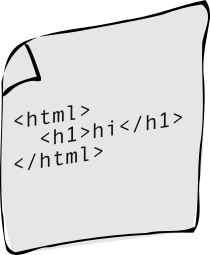

<section id="outline" class="level2">
<table class=outline-table style="font-size: x-large; margin: 10% 20%">
<tr>
  <td>Designing <em>and</em> Building</td>
  <td><em>Imagining new interfaces for our workflows…</em></td>
</tr>
<tr>
  <td>Asynchronous</td>
  <td><em>…that can be used in a “back and forth” fashion…</em></td>
</tr>
<tr>
  <td>Remote</td>
  <td><em>…and carried out even though the speaker and linguist are apart…</em></td>
</tr>
<tr>
  <td>Fieldwork tools</td>
  <td><em>…to collect <strong>structured</strong> documentary data…</em></td>
</tr>
<tr>
  <td><em>in the</em> Web Platform</td>
  <td><em>…using the open standards that make the web work.</em></td>
</tr>
</table>
</section>


<section id="outline-web" class="level2">
 
<table class=outline-table style="font-size: x-large; margin: 10% 20%">
<tr>
  <td>Designing <em>and</em> Building</td>
  <td><em>Imagining new interfaces for our workflows…</em></td>
</tr>
<tr>
  <td>Asynchronous</td>
  <td><em>…that can be used in a “back and forth” fashion…</em></td>
</tr>
<tr>
  <td>Remote</td>
  <td><em>…and carried out even though the speaker and linguist are apart…</em></td>
</tr>
<tr>
  <td>Fieldwork tools</td>
  <td><em>…to collect <strong>structured</strong> documentary data…</em></td>
</tr>
<tr class=outline-current>
  <td><em>in the</em> Web Platform</td>
  <td><em>…using the open standards that make the web work.</em></td>
</tr>
</table>

</section>


<section id="basic-problem" class="level2" style="grid-template-rows: auto 1fr; justify-items:space-between;">

<h2>The fundamental function of the internet is transferring HTML files between computers</h2>

<figure style="display:grid;grid-template-columns:2fr 1fr 2fr;">


</figure>

</section>


<section id=ftp style="grid-template: auto 1fr / 1fr 1fr;" class="level2">

<h2 style="text-align:center;grid-column: span 2;">Before the web, such transfers were not user-friendly at all.<br> For example, FTP (File Transfer Protocol) required a lot of typing.</h2>

<div class=terminal id=ftp-log>

```shell
220 Welcome to FTP Server
User (ftp.server.com:(none)): pat
331 Password required for pat
Password: ********
230 User pat logged in
Remote system type is UNIX.
Using binary mode to transfer files.
ftp> ls
200 PORT command successful
150 Opening ASCII mode data connection for file list
drwxr-xr-x   2 pat     ftpusers      4096 Jan 1 12:00 documents/
drwxr-xr-x   2 pat     ftpusers      4096 Jan 1 12:00 images/
-rw-r--r--   1 pat     ftpusers      1.2K Jan 1 12:00 story.txt
226 Transfer complete
ftp> get story.txt
200 PORT command successful
150 Opening BINARY mode data connection for story.txt (4096 bytes)
226 Transfer complete
ftp> quit
221 Goodbye
```
</div>

<article class=conversation>
<p class="speech-bubble-left user" data-type="👨user">
Hey File Server!
</p>
<p class="speech-bubble-right server" data-type="🌐server" data-type="🌐server">
Greetings. Name and password please?
</p>
<p class="speech-bubble-left user" data-type="👨user">
Pat, •••••••••.
</p>
<p class="speech-bubble-right server" data-type="🌐server">
Hi Pat.
</p>
<p class="speech-bubble-left user" data-type="👨user">
What files do you have?
</p>
<p class="speech-bubble-right server" data-type="🌐server">
I have a directory called <code>documents/</code>, a directory called <code>images/</code>, and a file <code>story.txt</code>.
</p>
<p class="speech-bubble-left user" data-type="👨user">
Give me <code>story.txt</code>.
</p>
<p class="speech-bubble-right server" data-type="🌐server">
Here you go… 📄 <em>File is transferred to Pat’s computer…</em> Bye!
</p>
</article>

</section>

<section id=hackers-only class=level2>
<figure style=text-align:center;>

<figcaption style="box-shadow:-1px 1px 1px black;padding:1em;display:inline;background:white;font-size:2rem;">
It was hackers-only in those days.
</figcaption>
</figure>

</section>


<section id=the-browser class="level2" style="grid-template: auto 1fr;">

<h2 style="text-align:center;">What made the web much easier to use than previous internet tools was that it hid a lot of detail: <br>You don’t have to be a hacker, you just learn to look at a document (or “web page”) and click the bits of text with blue underlines!</h2>

<figure style="max-height:100%;overflow-y:scroll;">

</figure>

</section>


<section id=the-browser class="level2" style="grid-template: auto 1fr;">

<h2 style="text-align:center;">Behind the scenes, it’s just an <code>HTML</code> file.</h2>


<figure style="max-height:100%;overflow-y:scroll;">

</figure>

</section>


<section id=the-browser class="level2" style="">

<h2 style="margin:10% 20%; color:white;text-shadow:-1px 1px 0 black;font-size:3rem;text-align:center;background:transparent;">Web browsers are just programs like any other, except that they can “request” (copy) <code>HTML</code> files from other computers, and they know how to display or <em>render</em> the files that that the web servers send as “responses”.
</h2>

</section>


<section id="on-the-web" class="level2 header-left-right" style=" grid-template:auto 1fr / 1fr 1fr;">

<h2 style="grid-column:span 2">A “Web Server” is a computer that can function as a file server: it understands those requests for files, and can formulate “responses” containing the requested <code>HTML</code> files.
<br>Those rules constitute a “protocol” called <code>HTTP</code> (Hypertext Transfer Protocol).
<br>It is actually quite a bit like <code>FTP</code>, but the user never has to see it!
</h2>

<div id=logs>

<div class="terminal">

```shell
GET /index.html HTTP/2
Host: example.org
User-Agent: Mozilla/5.0 (Macintosh; Intel Mac OS X 10.15; rv:109.0) Gecko/20100101 Firefox/110.0
Accept: text/html,application/xhtml+xml,application/xml;q=0.9,image/avif,image/webp,*/*;q=0.8
Accept-Language: en-US,en;q=0.5
```

</div> 

<!-- .terminal -->

<div class="terminal">

```shell
HTTP/2 200 OK
content-encoding: gzip
accept-ranges: bytes
age: 247513
cache-control: max-age=604800
content-type: text/html; charset=UTF-8
date: Fri, 24 Feb 2023 20:50:56 GMT
etag: "3147526947"
expires: Fri, 03 Mar 2023 20:50:56 GMT

<!doctype html>
<html>
<head>
    <title>Example Domain</title>

    <meta charset="utf-8" />
    <meta http-equiv="Content-type" content="text/html; charset=utf-8" />
    <meta name="viewport" content="width=device-width, initial-scale=1" />
    <style type="text/css">
    body {
        background-color: #f0f0f2;
        margin: 0;
        padding: 0;
        font-family: -apple-system, system-ui, BlinkMacSystemFont, "Segoe UI", "Open Sans", "Helvetica Neue", Helvetica, Arial, sans-serif;
        
    }
    div {
        width: 600px;
        margin: 5em auto;
        padding: 2em;
        background-color: #fdfdff;
        border-radius: 0.5em;
        box-shadow: 2px 3px 7px 2px rgba(0,0,0,0.02);
    }
    a:link, a:visited {
        color: #38488f;
        text-decoration: none;
    }
    @media (max-width: 700px) {
        div {
            margin: 0 auto;
            width: auto;
        }
    }
    </style>    
</head>

<body>
<div>
    <h1>Example Domain</h1>
    <p>This domain is for use in illustrative examples in documents. You may use this
    domain in literature without prior coordination or asking for permission.</p>
    <p><a href="https://www.iana.org/domains/example">More information...</a></p>
</div>
</body>
</html>

```

</div> 

</div>
<!-- .article -->

<article class=conversation style="grid-column:2">
<p class="speech-bubble-left user" data-type="👨user">
Hey web server at example.com, I’m speaking <code>HTTP</code>.  I want the file <code>index.html</code>. 
</p>
<p class="speech-bubble-right server" data-type="🌐server" data-type="🌐server">
This is <code>example.org</code>. I have your file. Here’s some information about the file, and here comes the data itself.
</p>
</article>

</section>


<section id="http-protocol" class="level2" style="grid-template-rows: auto 1fr; justify-items:space-between;">

<h2>So it’s not wrong to think about the web (primarily) as a system for using browsers to transfer <code>HTML</code> files between computers.</h2>

<figure style="display:grid;grid-template: auto auto /2fr 1fr 2fr;">



<figcaption><code>example.org</code></figcaption>
<figcaption><code>index.html</code></figcaption>
<figcaption><code>https://example.org/index.html</code></figcaption>
</figure>

</section>


<section id=make-a-site class=level2 >
<h2>
So what does it take to <em>make</em> a web site?
</h2>
<div style="background:white;margin:20% 10%;padding:1em;font-size:2rem;">
<p>In principle, it’s pretty simple:</p>
<ol>
<li>Copy some <code>HTML</code> files to a directory on a Web Server — a computer that has a <em>domain name</em> and is programmed to handle <code>HTTP</code></li>
<li>Share a  <code>URL</code> containing that domain name and a path to some your <code>HTML</code> files.</li>
</ol>
<p>Boom, your content is on the web.</p>
</div>
</section>


<section id=what-the-heck class="level2" style="justify-items:center; grid-template-rows: auto 1fr ">

<h2>What the heck does all this have to do with fieldwork?</h2>

<h3 style="font-size:20em;">🤔</h3>

</section>


<section id="outline-web-remote" class="level2">
 
<table class=outline-table style="font-size: x-large; margin: 10% 20%">
<tr>
  <td>Designing <em>and</em> Building</td>
  <td><em>Imagining new interfaces for our workflows…</em></td>
</tr>
<tr>
  <td>Asynchronous</td>
  <td><em>…that can be used in a “back and forth” fashion…</em></td>
</tr>
<tr class=outline-current>
  <td>Remote</td>
  <td><em>…and carried out even though the speaker and linguist are apart…</em></td>
</tr>
<tr>
  <td>Fieldwork tools</td>
  <td><em>…to collect <strong>structured</strong> documentary data…</em></td>
</tr>
<tr class=outline-done>
  <td><em>in the</em> Web Platform</td>
  <td><em>…using the open standards that make the web work.</em></td>
</tr>
</table>

</section>


<section class=level2 id="parrish-and-oswalt" style="grid-template: auto 1fr / auto 1fr;">
<h2 style="grid-column:span 2">Typically,  or at least traditionally, linguists and speakers work together, in person, carrying out all kinds of documentation tasks: 
.</h2>
<figure  style="">

</figure>
<div style="display:flex;flex-direction:column;align-items:space-around;background:white;font-size:2rem;margin:5em;padding:2em;">
<p>
</p>
<ol>
<li>collecting word lists
<li>recording and transcribing narratives
<li>eliciting grammatical evidence
<li>etc., etc.…
</ol>
<p>
<em>Some</em> of these tasks lend themselves to a remote, web-based scenario.
</p>
</div>
</section>


<section style=height:100%; id="html-documents-for-documentation" class="level2">
<h2>Sharing documents over the web in a remote context</h2>

<div style="height:100%;display:grid;grid-template-columns:1fr 1fr 1fr;">
<figure></figure>

<div class="scrollable" style="">
<article id=animal-photos>
  <h3>Animal photos</h3>
  <div class=animal-grid>


  </div>
</article>
<article>
<h3>Some California Animals</h3>
<p>CAn you 

</article>
</div>
  
<figure></figure>

</div>

</section>


<section id="outline-web-async" class="level2">
 
<table class=outline-table style="font-size: x-large; margin: 10% 20%">
<tr>
  <td>Designing <em>and</em> Building</td>
  <td><em>Imagining new interfaces for our workflows…</em></td>
</tr>
<tr class=outline-current>
  <td>Asynchronous</td>
  <td><em>…that can be used in a “back and forth” fashion…</em></td>
</tr>
<tr class=outline-done>
  <td>Remote</td>
  <td><em>…and carried out even though the speaker and linguist are apart…</em></td>
</tr>
<tr>
  <td>Fieldwork tools</td>
  <td><em>…to collect <strong>structured</strong> documentary data…</em></td>
</tr>
<tr class=outline-done>
  <td><em>in the</em> Web Platform</td>
  <td><em>…using the open standards that make the web work.</em></td>
</tr>
</table>

</section>


<section id="outline-web-" class="level2">
</section>
<script type=module src="slides.js"> </script>
