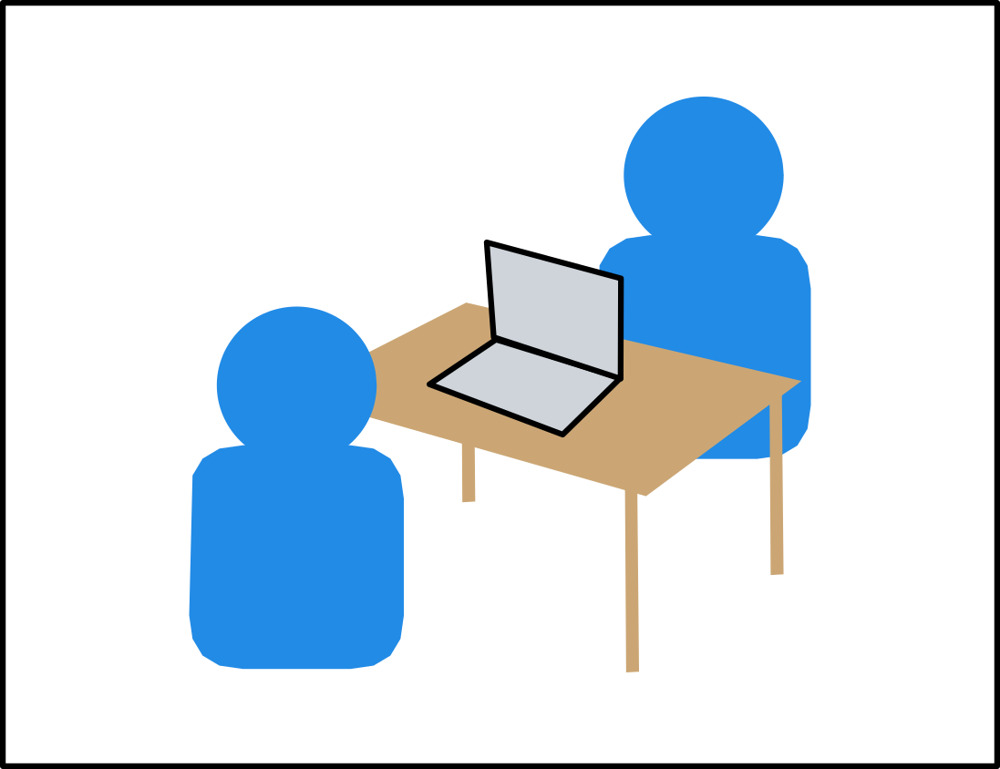
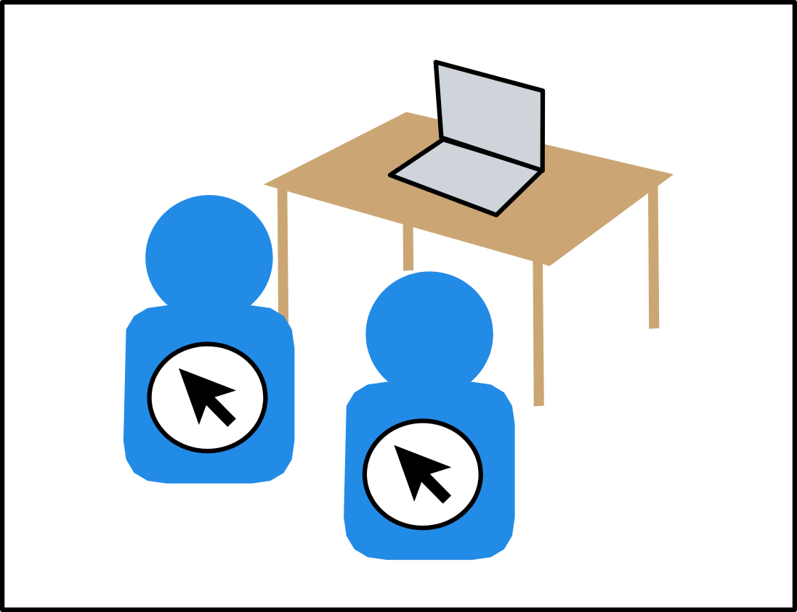
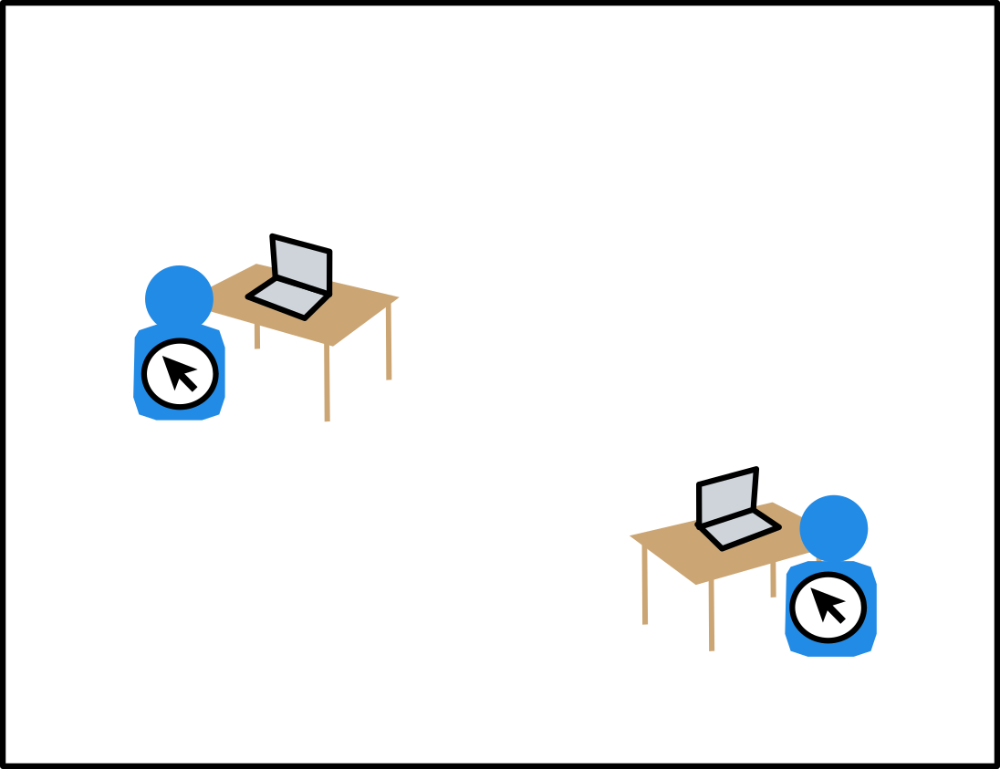
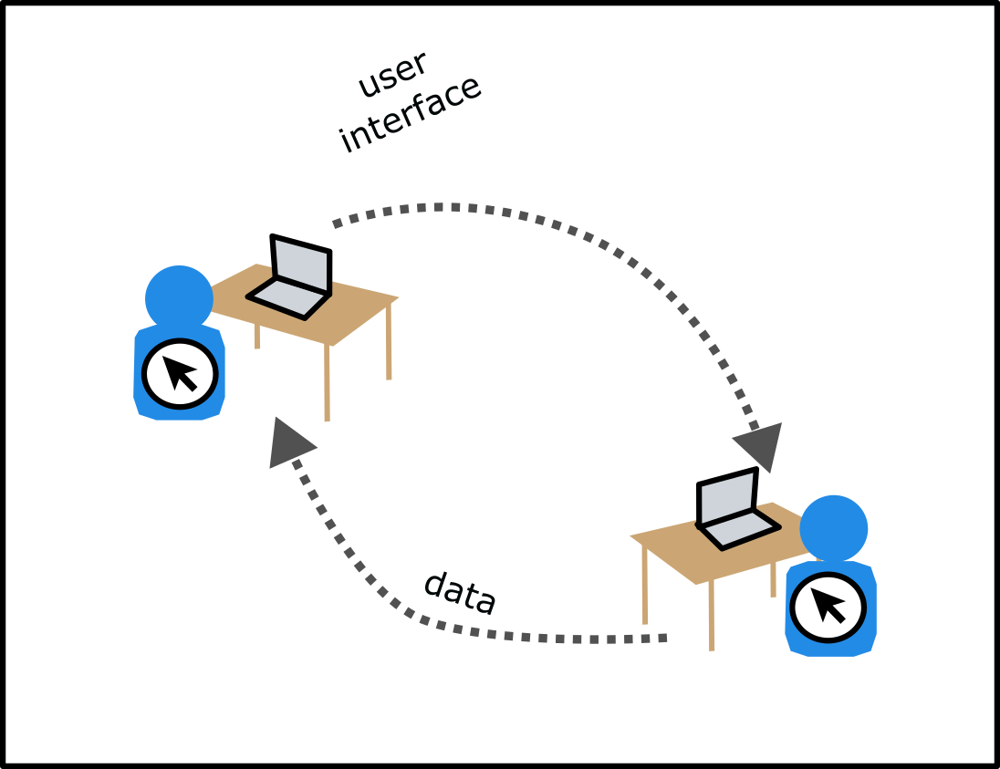
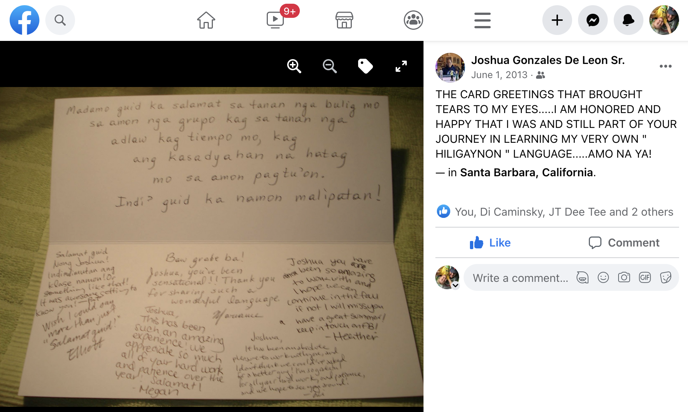

:::{.banner-two}
## <strong>Together</strong> Linguist with notebook, talking to speaker

<figure>

</figure>

<figure class=photo>

</figure>
:::

:::{.banner-two}
## <strong>Together</strong> Linguist with laptop, talking to speaker

<figure>

</figure>

<figure class=photo>
<video controls id=maestro_pat src="assets/maestro-pat/maestro_pat.mp4#t=168,186"></video>
</figure>
:::

:::{.banner-two}
## <strong>Together</strong> Speaker can see screen with interface in use

<figure>

</figure>

<figure class=photo>

</figure>
:::


:::{.banner-two}
## <strong>Together</strong> Linguist and speaker share control of interface

<figure>

</figure>


* Linguist and speaker are co-present
* Both can use the user interface
* Possible, not terribly common AFAICT
* Sometimes addressed under the topic of training speakers
* May involve very complicated software (ELAN, FLEx, etc.)

:::

:::{.banner-two}
## <strong>Remote</strong>  Zoom-style “viewing” interaction — linguist controls interface

<figure>

</figure>
:::


:::{.banner-two}
## <strong>Remote</strong> Asynchronous interface with custom fieldwork interface

<figure>

</figure>

<div>
One of the reasons (I believe) we haven’t seen much development of interfaces designed to be usable for the user is that we assume that shared applications should have full, realtime interaction like something like Google Docs…
</div>
:::


:::{.banner-two}

## <strong>Remote</strong> Google Docs-style “realtime” interaction

<figure>

</figure>

<div>
* Both users looking at a shared interface
* Both users have a cursor
* Work is synced to the cloud (a server) in real time 

### _All of these are really hard to implement and maintain._
</div>
:::


:::{.banner-two}
## <strong>Remote</strong> Asynchronous interface with custom fieldwork interface

<figure>

</figure>

<div>
One of the reasons 
</div>
:::


:::{.banner-two}
## <strong>Remote</strong> Asynchronous interface with custom fieldwork interface

<figure>

</figure>

<div>
One of the reasons 
</div>
:::

:::{.small-top-big-bottom}
## Yes, but…


### Another variable: Interactivity 

Two possible questions:

Who is _seeing_ the interface?

Who is _using_ the interface?

:::


:::{.small-top-big-bottom}

## File cabinet


:::

:::{.small-top-big-bottom}

## Custom applications open up other kinds of interactivity

* Possibilities beyond sharing stimuli (although that’s great)
* The Web Platform is a good tool for building applications that speaker/users can use on their own.

:::


## Training

> Remote elicitation is predicated on a pre-established relationship between a specialist and a community member, and it requires specialized training before elicitation can begin. 

## When the speaker has experience using the web

Not hard to build applications that are usable

## Staged fieldwork


### prompts

* stuff

### schedules

* stuff

### narratives

* stuff

</main>


## The Web Platform

<!-- 
> the whole business of a web server is to translate a URL either into a filename, and then send that file back over the Internet, or into a program name, and then run that program and send its output back. <cite>Laurie, Ben, and Peter Laurie. <em>Apache: The definitive guide.</em> O'Reilly Media, Inc., 2003.</cite> -->

You can think of the Web Platform as “all the things a browser can do”. 

Most of that functionality is usable via `HTML` tags:

```html

<video src="">
```

<!-- 
## Other details

* recording consent -->


## Further references

* https://www.youtube.com/watch?v=CH3VPcevimA
* https://github.com/rgriscom/WebElicit/
* https://elararchive.org/blog/2020/06/25/remote-linguistic-elicitation-methods/
*
